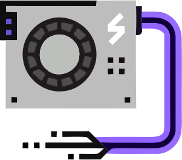

<br/>
<p align="center">
  <a href="https://github.com/idpNET/unique_deviceID">
    
  </a>

  <h3 align="center">Unique Hardware-based [or] Software-based device ID hash generation using PBKDF2 hashing (SHA256 Hashing Algorithm)</h3>

  <p align="center">
    This project provides a unique and customizable device ID hash generation method using PBKDF2 and SHA256 hashing algorithm.
    <br/>
    <br/>
    <a href="https://github.com/idpNET/unique_deviceID"><strong>Explore the docs »</strong></a>
    <br/>
    <br/>
    <a href="https://github.com/idpNET/unique_deviceID/issues">Report Bug</a>
    .
    <a href="https://github.com/idpNET/unique_deviceID/issues">Request Feature</a>
  </p>
</p>

## Table Of Contents

* [About the Project](#about-the-project)
  * [Installation](#installation)
* [Usage](#usage)
* [Roadmap](#roadmap)
* [Contributing](#contributing)
* [License](#license)
* [Authors](#authors)

## About The Project

This project provides a unique and customizable device ID hash generation method using PBKDF2 and SHA256 hashing algorithm. There are 2 modes to select:
1- FUll mode which uses both the hardware and software specs for device ID generation  
2- Semi mode which only uses hardware specs for device ID generation

Main Capabilities:

* Hardware-based and Software-based device ID generation modes
* PBKDF2 + SHA256 Hashing Algorithm
* Static Salting (settable)
* Customizable Hashing Key size + Hashing Iteration Times.
* Hashing process time tracking.

### Installation

1. Clone the repo in visual studio
```sh
https://github.com/idpNET/unique_deviceID.git
```
2. Run the app and Get Started!

## Usage

Running the console app, you get prompted to select the device ID generation mode (FULL: using both the hardware and software specs - Semi: using the hardware specs only). Hitting enter button, you get final results including the unique device ID hash value, and the process time.

P.S This project is well commented ! You can refer to the inline code comments for more information

## Roadmap

See the [open issues](https://github.com/idpNET/secure-facial-recognition-security-system-using-emguCV/issues) for a list of proposed features (and known issues).

## Contributing

Contributions are what make the open source community such an amazing place to be learn, inspire, and create. Any contributions you make are **greatly appreciated**.
* If you have suggestions for adding or removing projects, feel free to [open an issue](https://github.com/idpNET/secure-facial-recognition-security-system-using-emguCV/issues/new) to discuss it, or directly create a pull request after you edit the *README.md* file with necessary changes.
* Please make sure you check your spelling and grammar.
* Create individual PR for each suggestion.
* Please also read through the [Code Of Conduct](https://github.com/idpNET/secure-facial-recognition-security-system-using-emguCV/blob/main/CODE_OF_CONDUCT.md) before posting your first idea as well.

### Creating A Pull Request

1. Fork the Project
2. Create your Feature Branch (`git checkout -b feature/AmazingFeature`)
3. Commit your Changes (`git commit -m 'Add some AmazingFeature'`)
4. Push to the Branch (`git push origin feature/AmazingFeature`)
5. Open a Pull Request

## License

 licensed under the GNU General Public License v3.0

## Authors

* **Keyvan Hasani** - *Back-end developer and Ideapardaz.NET Administrator* - [Keyvan Hasani](https://github.com/idpNET) - *Developer*
